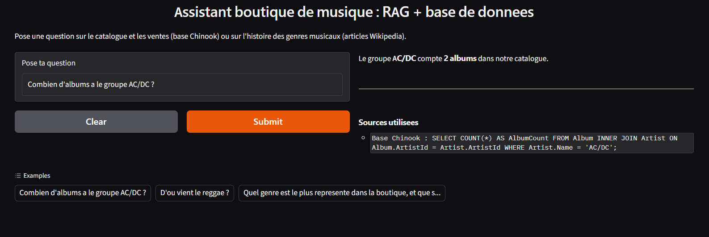
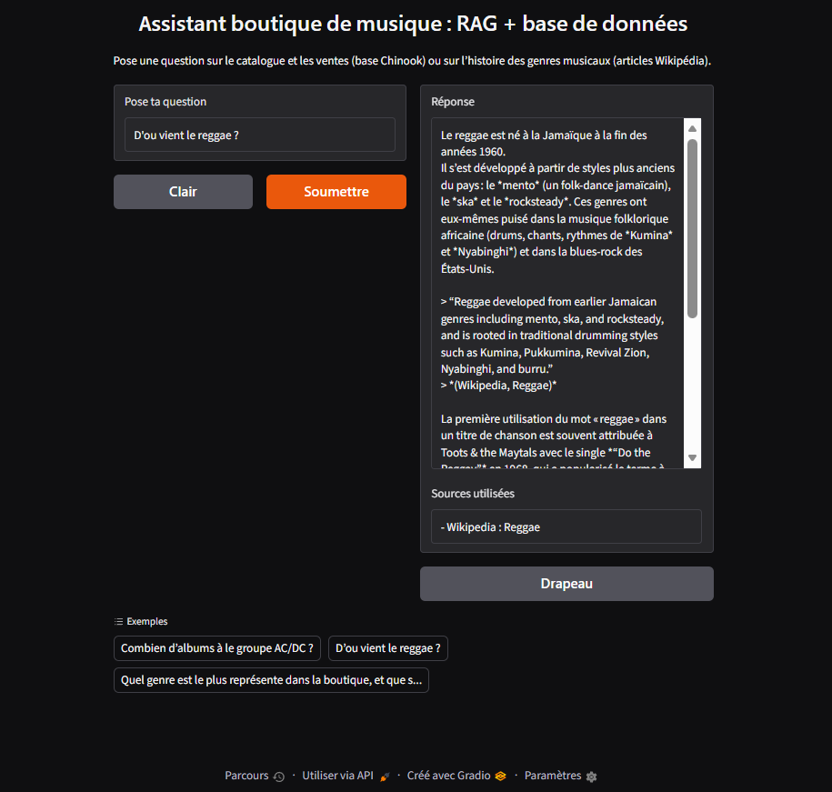
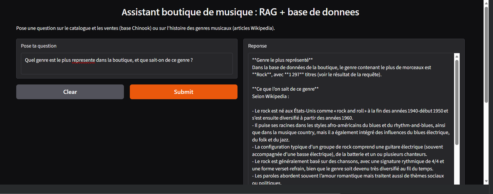
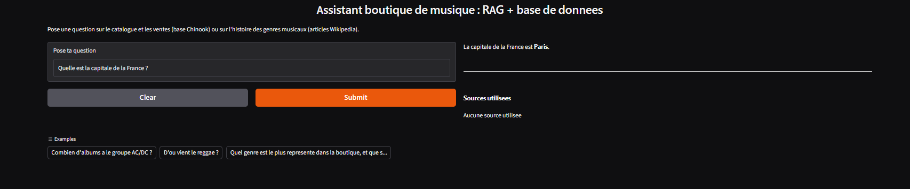

# RAG + SQL Music Assistant

An AI agent that answers questions by choosing between two sources: a real SQL database for facts and figures, and semantic search over Wikipedia articles for cultural context. Every answer shows the sources it used.

## Demo

## What it does

| Question | Source used | What it shows |
|---|---|---|
| How many albums does AC/DC have? | SQL database | Exact figures, with the generated query visible |
| Where does reggae come from? | Wikipedia | Cultural context, with the article name |
| Which genre is the most represented in the store, and what do we know about it? | Both | A figure from the database, then context from Wikipedia |
| What is the capital of France? | None | The interface states that no source was used |

## How it works

1. The question goes to an LLM that can call two tools.
2. `query_database` runs SQL on the Chinook database (a music store: artists, albums, tracks, customers, invoices).
3. `search_knowledge` searches 483 text chunks from 8 Wikipedia articles (rock, jazz, heavy metal, blues, reggae, latin, classical, hip hop) stored in ChromaDB.
4. The model reads the tool results and writes the answer, in French.
5. The interface lists the SQL query or the Wikipedia article behind each answer.

## Tech stack

- **LLM:** `openai/gpt-oss-20b` through the Groq API (tool calling)
- **Embeddings:** `all-MiniLM-L6-v2` (sentence-transformers, runs locally)
- **Vector store:** ChromaDB
- **Database:** SQLite (Chinook sample database)
- **Interface:** Gradio
- **Environment:** Google Colab

## Design decisions

- **Chunking:** 200 words per chunk with a 40-word overlap, so an idea cut at a boundary still appears whole in one chunk.
- **Cross-language search:** the articles and the embedding model are in English, while questions are in French. The tool description asks the LLM to write its search query in English, and the answer is written in French.
- **Source attribution:** each tool call is logged, so the interface can show the exact SQL query or article title.
- **Schema injection:** the real database schema is given to the model, which otherwise guessed table names (`artists` instead of `Artist`).

## Known limitations

- The tools use function calling, not an actual MCP server. Wrapping them in an MCP server is the natural next step.
- Sources are cited at article level, not at passage level.
- The model sometimes adds details beyond the retrieved passages. I spot-checked answers against the passages, but I have not run a systematic evaluation.
- The corpus is small (8 articles) and the agent has no conversation memory.
- Generated SQL is executed on the database directly. The tool description asks for SELECT only, but the code does not enforce it.
- The public Gradio link is temporary, so screenshots are included instead.

## Run it yourself

1. Open the notebook in Google Colab.
2. Add a `GROQ_API_KEY` secret (free key from console.groq.com).
3. Run all cells in order.

## Author

GahlasAicha
